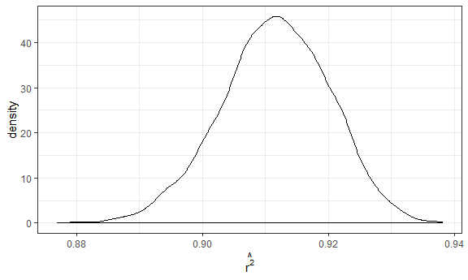

p8105\_hw6\_yl4359
================
Yue Lai

# Problem 1

## tidy bw\_data

``` r
bw_data = read_csv(file = "./data/birthweight.csv") %>% 
  mutate(babysex = as.factor(recode(babysex, "1" = "male", "2" = "female")),
         frace = as.factor(recode(frace, "1" = "White", "2" = "Black", "3" = "Asian", "4" = "Puerto Rican", "8" = "Other", "9" = "Unknown")),
         malform = as.factor(recode(malform, "0" = "absent", "1" = "present")),
         mrace = as.factor(recode(mrace, "1" = "White", "2" = "Black", "3" = "Asian", "4" = "Puerto Rican", "8" = "Other"))) %>% 
  select(bwt, blength, gaweeks, bhead, babysex, delwt, fincome)
```

    ## Parsed with column specification:
    ## cols(
    ##   .default = col_double()
    ## )

    ## See spec(...) for full column specifications.

## fit my regression model

``` r
fit_1 = lm(bwt ~ babysex*blength + gaweeks + delwt + fincome, data = bw_data)
```

I used baby’s sex and length at birth(include their interaction),
gestational age in weeks, mother’s weight at delivery and family monthly
income(main effects only) as predictors. And constructed a multiple
linear regression model. I think these factors will infludence the birth
weight of baby.

``` r
bw_data %>% 
  modelr::add_residuals(fit_1) %>% 
  modelr::add_predictions(fit_1) %>% 
  ggplot(aes(x = pred, y = resid)) + geom_point() +
  labs(x = "predictions",
       y = "residuals",
       title = "Plot of model residuals against fitted values")
```


## fit other two models

``` r
fit_2 = lm(bwt ~ blength + gaweeks, data = bw_data)
fit_3 = lm(bwt ~ bhead*blength*babysex, data = bw_data)
```

## compare three models

``` r
cv_df = 
  crossv_mc(bw_data, 100) 

cv_df =
  cv_df %>% 
  mutate(
    train = map(train, as_tibble),
    test = map(test, as_tibble))
```

``` r
cv_df = 
  cv_df %>% 
  mutate(fit_1 = map(train, ~lm(bwt ~ babysex*blength + gaweeks + delwt + fincome, data = .x)),
         fit_2 = map(train, ~lm(bwt ~ blength + gaweeks, data = .x)),
         fit_3 = map(train, ~lm(bwt ~ bhead*blength*babysex, data = .x))) %>% 
  mutate(rmse_fit1 = map2_dbl(fit_1, test, ~rmse(model = .x, data = .y)),
         rmse_fit2 = map2_dbl(fit_2, test, ~rmse(model = .x, data = .y)),
         rmse_fit3 = map2_dbl(fit_3, test, ~rmse(model = .x, data = .y)))
```

``` r
cv_df %>% 
  select(starts_with("rmse")) %>% 
  pivot_longer(
    everything(),
    names_to = "model", 
    values_to = "rmse",
    names_prefix = "rmse_") %>% 
  mutate(model = fct_inorder(model)) %>% 
  ggplot(aes(x = model, y = rmse)) + geom_violin() +
  labs(title = "Prediction error of three models")
```


From the violin plot, we could see that the third model is better,
because it has least prediction error.

# Problem 2

## import weather\_df dataset

``` r
weather_df = 
  rnoaa::meteo_pull_monitors(
    c("USW00094728"),
    var = c("PRCP", "TMIN", "TMAX"), 
    date_min = "2017-01-01",
    date_max = "2017-12-31") %>%
  mutate(
    name = recode(id, USW00094728 = "CentralPark_NY"),
    tmin = tmin / 10,
    tmax = tmax / 10) %>%
  select(name, id, everything())
```

    ## Registered S3 method overwritten by 'hoardr':
    ##   method           from
    ##   print.cache_info httr

    ## file path:          C:\Users\16462\AppData\Local\rnoaa\rnoaa\Cache/ghcnd/USW00094728.dly

    ## file last updated:  2019-09-26 10:28:01

    ## file min/max dates: 1869-01-01 / 2019-09-30

## create 5000 bootstrap samples

``` r
model_df = 
  weather_df %>% 
  modelr::bootstrap(n = 5000) %>% 
  mutate(
    models = map(strap, ~lm(tmax ~ tmin, data = .x)),
    results1 = map(models, broom::tidy),
    results2 = map(models, broom::glance)) 
```

## produce 5000 estimate for r^2

``` r
model_df_r =
  model_df %>%
  select(-strap, -models, -results1) %>% 
  unnest(results2) %>%
  janitor::clean_names() 
  
model_df_r %>% 
  ggplot(aes(x = r_squared)) +
  geom_density() +
  labs(x = expression(hat(r^2)))
```



``` r
quantile_r = quantile(pull(model_df_r, r_squared),c(.025, .975))
```

The distribution of estimated r^2 is left skewed.

The 95% confidence interval for r^2 is (0.894, 0.928).

## produce 5000 estimate for (beta1\*beta2)

``` r
model_df_beta =
  model_df %>% 
  select(-strap, -models, -results2) %>% 
  unnest(results1) %>% 
  select(.id, term, estimate) %>% 
  pivot_wider(names_from = term, values_from = estimate) %>%
  janitor::clean_names() %>% 
  mutate(beta_results = log(intercept*tmin)) 

model_df_beta %>% 
  ggplot(aes(x = beta_results)) + 
  geom_density() +
  labs(x = expression(log(hat(beta[0])*hat(beta[1]))))
```


``` r
quantile_beta = quantile(pull(model_df_beta, beta_results),c(.025, .975))
```

The distribution of estimate log(β<sub>0</sub>\*β<sub>1</sub>) is
approximately normal.

The 95% confidence interval for log(β<sub>0</sub>\*β<sub>1</sub>) is
(1.963, 2.057).
